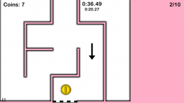

# Maze Runner

## Description and objective of the game

The aim of the game is to get through the various mazes in the shortest time possible. During the gameplay the player can collect coins and buy time or more movement speed with them, thus achieving a better result. The game ends when the player manages to pass all 10 created levels. In between levels, the user has the chance to buy upgrades to help him/her to a better result.

The player controls his dummy using the WASD keys. The player appears in each level exactly at the top center of the maze, and the goal is represented by a finisher's tape at the bottom center of the maze. In addition to the player's dummy and the target tape, there are coins on the screen that can be taken during gameplay.

This game falls under the genre of Puzzle games - find the right path. The game can be played by people of any age. They can compare the times achieved in each difficulty with each other. The best times can be seen in the "Highscores" section. The player is alone on the board.

## Objects

The main objects in the game are the maze and the player himself. Under the maze we can also include the coins that the player collects during the game and the finish line.

The player is represented in the maze by his dummy, which is shaped like an arrow. Other objects on the screen are text objects.

The text objects show us the running time, the time spent in the level, the level number and the number of coins collected.

## Game UI

At the beginning, the user finds himself in the main menu of the game, from which he can get further to the difficulty selection or to the game instructions. The game consists of three difficulties:

-   lightweight (dimensions 5×5 squares)
-   medium (10×10)
-   heavy (15×15)
    Difficulties vary in the size of the mazes, number of newly created coins, starting speed, and the ability to make up time in the shop.

After selecting a difficulty, the very first level will appear on the screen.

After successfully completing all 10 levels, you will be taken to the last screen, which will show you your final time.

